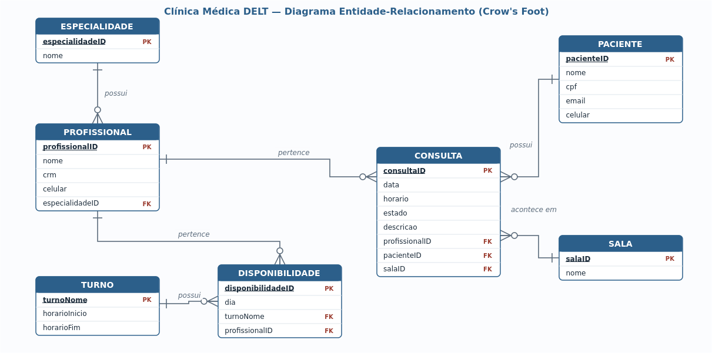

# 🏥 Clínica Médica DELT

[](https://github.com/andrevictorx/clinica-medica-delt/actions/workflows/ci.yml)
[](https://www.python.org/)
[](https://www.sqlite.org/)
[](tests/)
[](LICENSE)

Sistema de agendamento de uma clínica médica, em **Python + SQLite**, com
interface de menu no terminal. Projeto da disciplina **TE 901 — Banco de Dados
para Sistemas Embarcados** (Engenharia Elétrica / UFPR).

> Aplicação desenvolvida sobre um modelo relacional normalizado (1FN/2FN/3FN),
> com arquitetura em camadas, validação de regras de negócio e testes automatizados.

## 👥 Equipe

| Integrante | GRR |
|---|---|
| André Victor Xavier Pires | 20212735 |
| Gabriel Silverio Bernardelli | 20204933 |
| Patrick Henrique Pereira de Souza | 20242467 |

## 🗺️ Diagrama Entidade-Relacionamento



São 7 entidades com relacionamentos **1:N**. Detalhes em
[`docs/dicionario-dados.md`](docs/dicionario-dados.md) e análise de normalização
em [`docs/normalizacao.md`](docs/normalizacao.md).

## ✨ Funcionalidades

Menu principal (rubrica do trabalho):

1. **Agendar nova consulta** — valida disponibilidade do profissional e conflitos
   de horário (profissional, sala e paciente); cria a consulta como *Agendada*.
2. **Listar consultas do dia** — por data, com `JOIN`, ordenadas por horário.
3. **Consultar histórico de um paciente** — por CPF, em ordem cronológica
   decrescente, com especialidade e observações.
4. **Alterar status de uma consulta** — *Agendada / Realizada / Cancelada /
   Faltou*; ao realizar, exige observações; consultas realizadas ficam imutáveis.
5. **Relatório de atendimentos por profissional** — `GROUP BY` + `COUNT` com
   totais, realizadas, cancelamentos, faltas e consultas futuras.

**Bônus:** cadastrar paciente, cadastrar profissional e listar especialidades.

## 💻 Frontend web (React + Tailwind)

Além do programa em console, o projeto inclui uma **interface web profissional**
em [`frontend/`](frontend/) — React 19 + TypeScript + Vite + Tailwind CSS v4.

- **Paciente:** dashboard com próximas consultas, busca de médico com
  autocomplete, filtro por especialidade, calendário e seleção de horários que
  cruzam a disponibilidade do médico (verde = livre, vermelho = ocupado/bloqueado).
- **Médico:** agenda semanal em blocos de 30 min com cartões clicáveis, e
  configuração do padrão semanal de atendimento + bloqueios pontuais.
- **UX:** tour de onboarding guiado, skeleton loaders, toasts e identidade UFPR.
- **Integridade:** os dados são mock espelhando as 7 tabelas; nada altera o
  esquema (ver [frontend/README.md](frontend/README.md)).

```bash
cd frontend && npm install && npm run dev
```

## 🏗️ Arquitetura

```
src/clinica/
├── database.py      # conexão SQLite, PRAGMA foreign_keys, inicialização
├── repositories.py  # camada de acesso a dados — todo o SQL fica aqui
├── services.py      # regras de negócio (validações, transições de estado)
├── ui.py            # apresentação no terminal (cores, tabelas, input)
└── cli.py           # laço do menu principal
sql/
├── schema.sql       # CREATE TABLE
└── seed.sql         # INSERT de dados de teste
tests/               # testes pytest das regras de negócio
```

A separação **UI → Service → Repository → Database** mantém o SQL isolado, as
regras de negócio testáveis sem interface e a apresentação independente da lógica.

## 🚀 Como executar

Requer apenas **Python 3.10+** (biblioteca padrão; `sqlite3` já vem incluído).

```bash
git clone https://github.com/andrevictorx/clinica-medica-delt.git
cd clinica-medica-delt
python main.py
```

Na primeira execução o banco `clinica_medica.db` é criado a partir de
`sql/schema.sql` e populado com `sql/seed.sql` automaticamente.

## 🧪 Testes

```bash
pip install pytest
pytest -q
```

## 🛠️ Makefile

```bash
make run     # executa a aplicação
make test    # roda os testes
make der     # regenera o diagrama (docs/der.svg) e o PNG (precisa de LibreOffice)
make dump    # exporta os INSERTs do banco populado (sql/dump.sql)
make clean   # remove o banco e artefatos temporários
```

## 📄 Licença

[MIT](LICENSE) © 2026 Equipe Clínica Médica DELT.
